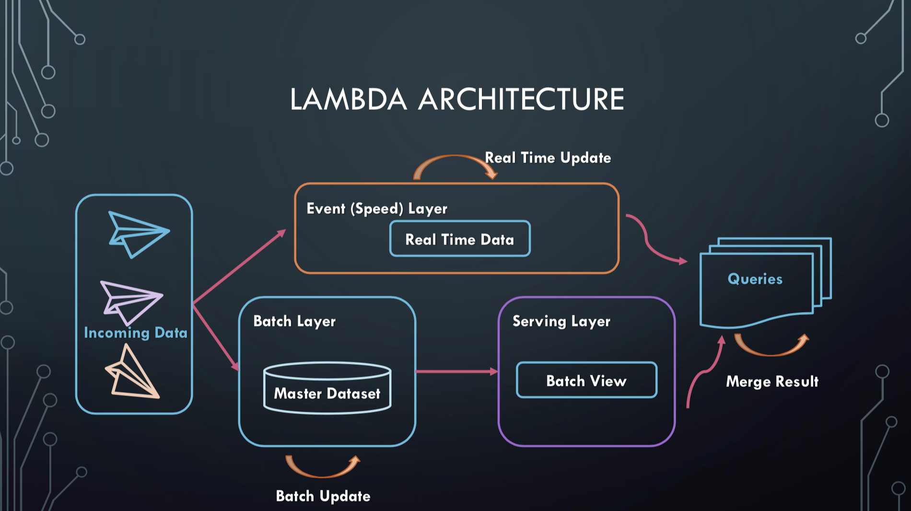
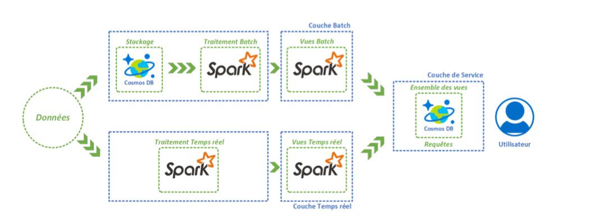

# Lambda Architecture Big Data

## How does it work ?

The Lambda architecture was thought by Nathan Marz and James Warren and mixes batch and streaming processes. It allows to store and process large volumes of data thanks to the batch while allowing the visualization of the recent results thanks to the treatment in real time.

A Lambda architecture consists of three layers:

- A layer Batch (Batch Layer) This layer allows the storage of all the data as well as a regular processing, data packets to constitute results (or views) searchable.

- A real-time layer (Speed ​​Layer) This layer processes the most recent data. It then generates "recent" views that are added to the Batch views. Namely, the views of this layer are, after a while, removed because they are considered obsolete.

- Service Layer This layer allows you to store and view the results of various processing performed on the input data. In practice, non-relational database systems (NoSQL) are used to perform this task.

## Tools used

### Azure Cosmos DB

Azure Cosmos DB is a globally distributed multi-model database service. Azure Cosmos DB lets you flexibly and independently scale throughput and storage in any number of Azure geographic regions. It offers guarantees in terms of throughput, latency, availability and consistency with full SLA contracts.

Key points :
- Worldwide distribution
- Many popular data models and APIs for consulting and querying
data (SQL, MongoDB, Cassandra, Gremlin, Table)
- Elastic adjustment of flow and storage on demand
- Possibility of creating highly reactive and strategic applications (low latency)
- Continually assured availability (99.99% SLA availability contract)
- Low total cost of ownership (5 to 10 times cheaper than an unmanaged solution
or a local NoSQL solution.)
- No schema or database index management
### Azure HDInsight

Azure HDInsight is a tool for deploying different clusters of the Hadoop environment. HDInsight is an easy, fast and cost-effective solution for processing large volumes of data. HDInsight makes it possible to deploy popular open source infrastructures (Hadoop, Spark, Hive, Kafka, Storm ...) and thus build many scenarios around the processing of large volumes of data.

Key points :

- Native Cloud
Enables automated deployment of many clusters while providing an SLA.
- Economical and evolutionary
It is possible to vary the power of the workloads of HDInsight clusters and thus control their costs.
- Security and compliance
There are several ways to secure infrastructure (virtual networks, encryption ...) that meet government compliance standards.
- Monitoring
HDInsight integrates with Azure platform analysis tools and provides an interface to manage clusters.
- Availability
HDInsight is available in more than 25 regions of the world.

### Spark

Spark is a tool for processing large volumes of data in a distributed manner (Cluster Computing). The framework offers a simpler programming model than Hadoop and allows execution times up to 100 times shorter.

-  Speed
Runs programs up to 100 times faster than Hadoop MapReduce in memory or 10 times faster on disk.
- Ease of use
Writing applications in Java, Python, Scala, R ...
- Generality
Combines SQL, streaming and complex analysis.
- Works everywhere
Spark runs on Hadoop, Mesos, standalone or in the cloud. It can access various data sources, including HDFS, Cassandra, HBase and S3.
- Open Source

# Architecture Lambda in Azure

With regard to the real time and batch layers, it has previously been seen that Spark was able to perform both types of processing. In addition, thanks to the Azure HDInsight PaaS tool, we are well able to deploy a Spark cluster.
Next, for storage and service layer, we previously identified that a nonrelational database system could be used. Thus, the Azure Cosmos DB brick lends itself well to the situation.

